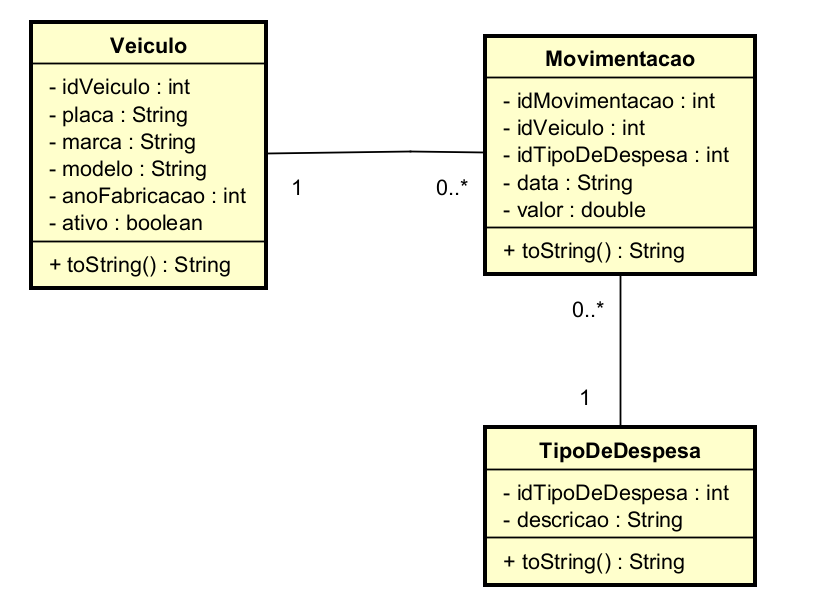

# GynLog – Sistema de Controle de Gastos de Frota

Sistema desenvolvido em Java com interface gráfica, voltado ao controle e gerenciamento dos gastos financeiros de uma frota veicular. O projeto foi desenvolvido como Projeto Integrador do curso de Engenharia de Software, com foco na aplicação prática dos principais conceitos de Programação Orientada a Objetos (POO) e Engenharia de Software.

## Contexto do Projeto
O sistema foi desenvolvido para atender às necessidades da empresa fictícia GynLog, do setor de transporte de cargas, que necessita registrar, organizar e analisar os gastos associados aos veículos de sua frota, promovendo maior controle financeiro e responsabilidade na gestão dos recursos.

## Funcionalidades
- Cadastro e gerenciamento de veículos da frota (ativos e inativos)
- Cadastro de tipos de despesas (combustível, manutenção, IPVA, multas, entre outros)
- Registro de movimentações financeiras associadas aos veículos
- Geração de relatórios gerenciais, incluindo:
    - Despesas por veículo
    - Somatório geral de despesas em determinado mês
    - Total de gastos com combustível em um mês
    - Somatório de IPVA por ano
    - Listagem de veículos inativos
    - Relatório de multas por veículo em determinado ano

## Conceitos de Programação Orientada a Objetos Aplicados
O projeto foi estruturado utilizando o paradigma de orientação a objetos, aplicando de forma prática os seguintes conceitos:
- Classes e objetos
- Encapsulamento
- Herança
- Polimorfismo
- Sobrecarga de métodos
- Separação de responsabilidades
- Tratamento de erros e validações de dados

## Arquitetura e Estrutura
- Linguagem: Java
- Interface gráfica desenvolvida com Java Swing
- Armazenamento de dados em arquivos texto, permitindo posterior manipulação via planilhas eletrônicas
- Organização do código visando clareza, manutenção e escalabilidade, seguindo princípios próximos ao padrão MVC

## Tecnologias Utilizadas
- Java
- Java Swing
- NetBeans IDE
- IntelliJ IDEA
- Git e GitHub

## Diagrama de Classes

O diagrama abaixo representa as principais entidades do sistema e seus relacionamentos.

## Como Executar
1. Clone o repositório
2. Abra o projeto no IntelliJ IDEA
3. Configure o JDK compatível
4. Execute a classe principal que contém o método `main`

## Observações
O projeto prioriza a lógica de negócio, organização do código e aplicação dos conceitos de POO. A interface gráfica possui caráter funcional, servindo como meio de interação com o sistema.

## Autor
Fernando Diógenes
